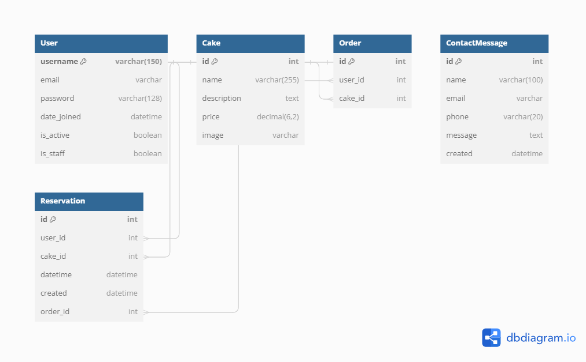
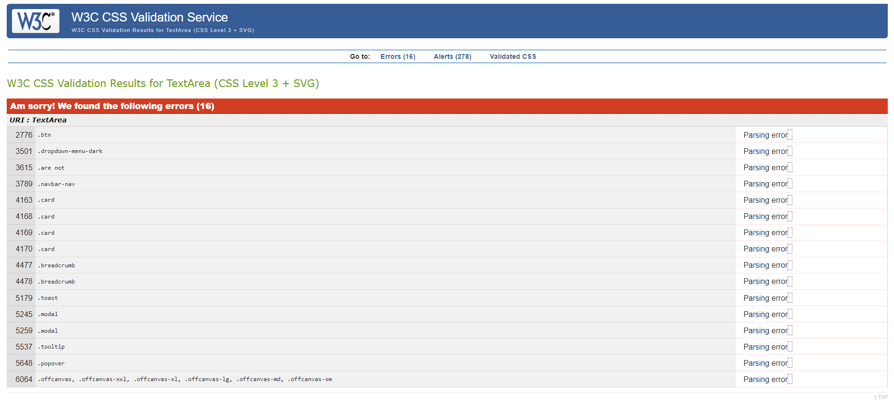
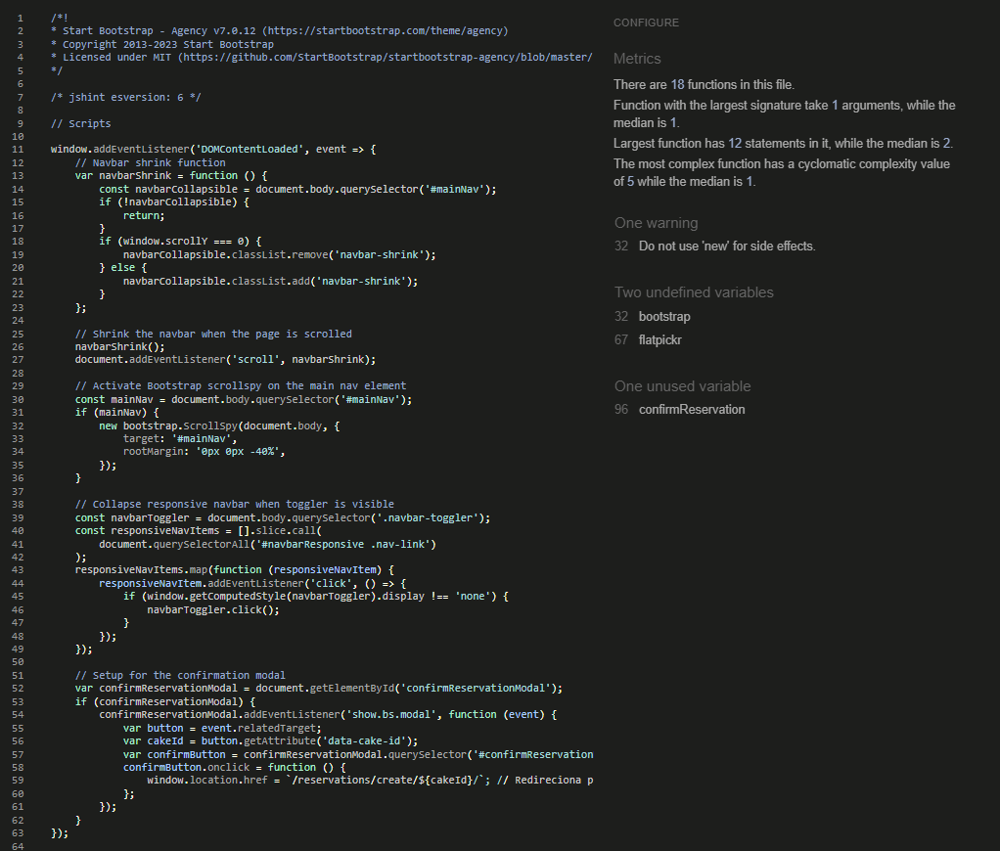
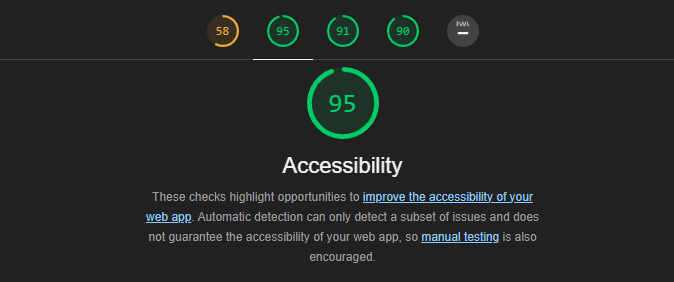

# Project-Portfolio 1
# Gamela Cake

## Overview
Welcome to Gamela Cake, an innovative cake reservation management platform that seamlessly integrates user-friendly features with sophisticated cake selection and booking systems. Designed to provide an effortless and enjoyable cake ordering experience, our platform offers a range of functionalities tailored to both casual browsers and serious confectionery enthusiasts.

[Here is the live version of the project](https://gamela-cake-5a01bc199f23.herokuapp.com/)


## Strategy

**Project objectives**
The project consisted of creating a reservation system website for my sister bakery called Gamela Cake, based in Guinea-Bissau, which has a variety of good cakes and can also customize them. The main purpose of the website was to allow customers to browse the confectionery products and make reservations, allow customers to send emails to obtain additional information about the online store and allow users to interact through the reviews they book.


## User Stories
Based on the objective of my website, I created this user story

### USER STORY: Make a Reservation
As a **customer** I can **select a date and time for my reservation** so that **planning is done well in advance.**

#### Acceptance Criteria

- The system must provide a calendar and clock interface for selecting a reservation date and time.
- The system must display the available time slots based on the bakery's operating hours and existing reservations.
- The menu must list all available cakes with descriptions and prices.
- The system must prevent a user from booking a time slot that is already reserved by another customer.
- The reservation process must be completed without system errors.

#### Task

- [x] Design a calendar and time selection interface.
- [x] Implement logic to fetch and display available time slots.
- [x] Create a dynamic menu display system with cake details and prices.
- [x] Develop a reservation conflict detection and prevention mechanism.
- [x] Integrate a reservation completion and error handling process.

### USER STORY: View Reservations
As a **customer** I can **view all my upcoming and past reservations,** so that **event management and reminiscence are straightforward.**

#### Acceptance Criteria

- The system must provide a personal dashboard where a customer can view all their upcoming and past reservations.
- The dashboard must display the date, time, and details of the cakes ordered for each reservation.
- Past reservations must be clearly distinguished from upcoming ones.

#### Task

- [x] Develop a user dashboard to display reservation details.
- [x] Implement filters to separate upcoming and past reservations.
- [x] Ensure the dashboard pulls and displays accurate reservation data.

### USER STORY: Modify a Reservation
As a **customer** I can **change the date, time, and cake options for my reservation,** so that **adjustments to plans are accommodated.**

#### Acceptance Criteria

- The system must allow changes to the date, time, and cake selection up to a certain cut-off time before the reservation.
- Any modifications must be confirmed by the customer and acknowledged by the system through an updated confirmation.

#### Tasks 

- [x] Create a feature to edit reservation details within the user dashboard.
- [x] Implement business logic to handle cut-off times for modifications.
- [x] Set up a confirmation system for any changes made to a reservation.

### USER STORY: Cancel a Reservation
As a **customer** I can **cancel my reservation,** so that **changes in plans are easily handled without penalty.**

#### Acceptance Criteria

- The system must allow a reservation to be cancelled up to a certain cut-off time before the reservation date.
- The customer must receive a cancellation confirmation via email.
- No penalty must be charged if the cancellation is made within the permitted time frame.

#### Tasks

- [x] Develop a cancellation feature within the user dashboard.
- [x] Implement business logic for cancellation cut-off times.
- [x] Integrate an email system to send cancellation confirmations.


### USER STORY: User Registration
As a **guest** I can **create an account in the system,** so that **booking and event management are enabled.**

#### Acceptance Criteria

- The registration form must capture essential information such as name, email, and password.
- The system must validate the email address format and password strength.
- Upon successful registration, the user must be directed to their personal dashboard.

#### Tasks

- [x] Design a user registration form.
- [x] Implement form validation for email and password fields.
- [x] Set up a user authentication system to handle new registrations.


### USER STORY: User Login
As a **registered user** I can **log in to the system,** so that **access to personal information and reservations is secured.**

#### Acceptance Criteria

- The login process must authenticate users based on their email and password.
- The system must provide error messages for incorrect login credentials.
- Upon successful login, the user must be directed to their personal dashboard.

#### Tasks

- [x] Design a user login form.
- [x] Implement authentication logic to verify user credentials.
- [x] Develop a session management system to handle user logins and redirects.


### USER STORY: View Menu
As a **customer** I can **view a cake menu** so that **informed decisions about product selection are made.**

#### Acceptance Criteria

- The menu must list all cakes with images, descriptions, and prices.
- The menu must be accessible to all users, registered or not.
- The menu must be updated in real-time to reflect any changes in cake availability or prices.

#### Tasks

- [x] Design a layout for the cake menu.
- [x] Implement a system to retrieve and display real-time data for cakes.
- [x] Ensure the menu is accessible and navigable for all users.


### USER STORY: Select Cakes
As a **customer** I can **add cakes from the menu to my reservation,** so that **the order meets the event's requirements.**

#### Acceptance Criteria:

- The system must allow users to add cakes to their reservation from the menu.
- The system must update the reservation summary in real-time as cakes are added or removed.
- The system must provide an option to review the final selection before confirming the reservation.

#### Tasks

- [x] Develop a feature to add cakes to a reservation.
- [x] Implement real-time updates to the reservation summary.
- [x] Design a review page for final order confirmation.


### USER STORY: Receive Reservation Confirmation
As a **customer** I can **receive immediate email confirmation after making a reservation,** so that **confirmation of booking is ensured.**

#### Acceptance Criteria

- The system must send an email confirmation immediately after a reservation is made.
- The email must include the reservation date, time, and details of the cakes ordered.
- The email must provide a reservation number for reference.

#### Tasks

- [ ] Set up an automated email system for reservation confirmations.
- [ ] Design email templates for confirmation messages.
- [ ] Implement a reservation reference system.


#### USER STORY: Reservation Reminders
As a **customer** I can **receive reminders of my upcoming reservation,** so that **the event is remembered and attended.**

#### Acceptance Criteria

- The system must send an email reminder 24 hours before the reservation date.
- The reminder must include the reservation date, time, and location.
- The reminder must provide an option to modify or cancel the reservation.

#### Tasks

- [ ] Integrate an automated email reminder system.
- [ ] Design reminder email templates.
- [ ] Implement a feature for users to modify or cancel reservations from the reminder email.

## Skeleton 

### Database Schema

This section provides an overview of the database schema used in our application. The schema includes five main tables: User, Cake, Order, ContactMessage, and Reservation. Each table is designed to store specific information related to our cake reservation system.


### Models
The Gamela Cake application utilizes a relational database model, specifically Postgres, facilitated through Elephant SQL. Below is a comprehensive breakdown of each model used in the application, explaining their roles and relationships:

<details>

<summary>User Model</summary>

```python
class User(models.Model):
    # Model fields
    username = models.CharField(max_length=150, unique=True)
    email = models.EmailField(unique=True)
    password = models.CharField(max_length=128)
    date_joined = models.DateTimeField(auto_now_add=True)
    is_active = models.BooleanField(default=True)
    is_staff = models.BooleanField(default=False)

    # String representation
    def __str__(self):
        return self.username
```
**Description:**
- This model stores user authentication and profile information.
- It contains fields for the username, email, password, and date joined, along with flags for active status and staff privileges.

</details>
<details>

<summary>Cake Model</summary>

```python
class Cake(models.Model):
    # Model fields
    name = models.CharField(max_length=255)
    description = models.TextField()
    price = models.DecimalField(max_digits=6, decimal_places=2)
    image = CloudinaryField('image', default='placeholder')

    # String representation
    def __str__(self):
        return self.name
```
**Description:**
- Represents the cakes available for reservation or purchase.
- Includes details like name, description, price, and an image stored using Cloudinary.

</details>
<details>

<summary>Order Model</summary>

```python
class Order(models.Model):
    # Model relationships
    user = models.ForeignKey(settings.AUTH_USER_MODEL, on_delete=models.CASCADE)
    cake = models.ForeignKey(Cake, on_delete=models.CASCADE)

    # String representation
    def __str__(self):
        return f"Order {self.id} for {self.user.username}"
```
**Description:**
- Captures orders made by users, linking them to specific cakes.
- Establishes relationships with the User and Cake models.

</details>
<details>

<summary>ContactMessage Model</summary>

```python
class ContactMessage(models.Model):
    # Model fields
    name = models.CharField(max_length=100)
    email = models.EmailField()
    phone = models.CharField(max_length=20)
    message = models.TextField()
    created = models.DateTimeField(auto_now_add=True)

    # String representation
    def __str__(self):
        return f"Message from {self.name}"
```
**Description:**
- Used for storing contact messages sent by users through the website.
- Includes sender details and the message content.

</details>
<details>

<summary>Reservation Model</summary>

```python
class Reservation(models.Model):
    # Model relationships
    user = models.ForeignKey(settings.AUTH_USER_MODEL, on_delete=models.CASCADE)
    cake = models.ForeignKey(Cake, on_delete=models.CASCADE)
    datetime = models.DateTimeField(default=timezone.now)
    created = models.DateTimeField(auto_now_add=True)
    order = models.OneToOneField(Order, on_delete=models.SET_NULL, null=True, blank=True, related_name='reservation')

    # String representation
    def __str__(self):
        return f"Reservation for {self.cake.name} by {self.user.username}"

    # Custom method
    def can_cancel(self):
        return timezone.now() <= self.datetime - timedelta(hours=24)
```
Description:
- Manages cake reservations made by users.
- Links to User, Cake, and Order models, and includes fields for reservation time and creation time.
- Features a custom method can_cancel to enforce a 24-hour cancellation policy.
</details>


## Features

### Landing Page - Before and After Login


### Cake List Section


### Contact Section


### Footer


### Login Page


### Signup Page


### Cake Page


### Reservation Page


### Cake Booking Page


### Edit Reservation Page


### Delete Reservation Page


### User Page


## Testing and Bugs Fixed

### Error: ModuleNotFoundError at Django Admin Login Page
**Issue:**
Attempted to access the Django admin login page and encountered a ModuleNotFoundError.
Error Message: No module named 'clodinary_storage'.
Cause: Triggered when the server tried to load static files storage configuration.
**Resolution:**
Identified as a typographical error in settings.py.
Original setting: STATICFILES_STORAGE = 'clodinary_storage.storage.StaticHashedCloudinaryStorage'.
Corrected to: STATICFILES_STORAGE = 'cloudinary_storage.storage.StaticHashedCloudinaryStorage'.
Outcome: Successful recognition of the module, enabling the Django application to locate and load the static files storage configuration.

### Error: TemplateSyntaxError on Homepage
**Issue:**
Encountered TemplateSyntaxError on the homepage.
Error Details: Invalid block tag 'static' on line 48, expected 'endblock'.
Context: Occurred during a GET request to the homepage.
**Resolution:**
Error caused by improper placement of  tag within a  without preceding .
Solution: Ensured  was included at the start of each template using the  tag.
Outcome: Resolved the TemplateSyntaxError, allowing the homepage to load correctly.

### Error: NoReverseMatch in Initial Page Load
**Issue:**
Faced NoReverseMatch errors when loading the initial page.
Specific Error: Absence of the URL named 'reserve' in the template.
**Resolution:**
- Analyzed and identified the mismatch in URL naming.
- Updated urls.py to include a route named 'reserve' pointing to the appropriate view.
- Adjusted template references to use the correct route names as defined in urls.py.
Outcome: Successfully resolved the NoReverseMatch error, ensuring correct template rendering and navigation.

### Warning: RuntimeWarning during Django Migrations
**Issue:**
Received RuntimeWarning during Django migrations.
Warning Details: DateTimeField Reservation.datetime received a naive datetime (...) while time zone support is active.
**Resolution:**
- Recognized the need to use timezone-aware datetimes in Django models.
- Implemented the use of timezone.now() function from Django to set timezone-aware default values.
Outcome: Migrations performed without warnings, ensuring compliance with Django's timezone support.

### TemplateDoesNotExist Error
**Issue:**
Encountered a TemplateDoesNotExist error while attempting to delete a reservation. The system reported that the template reservation_confirm_delete.html was missing.
**Resolution:**
- Created the missing template reservation_confirm_delete.html.
- This allowed Django to properly render the page for confirmation of reservation deletion.
Outcome: Successfully resolved the error, enabling the deletion process to proceed with the necessary confirmation step.

### Initial NoReverseMatch Error
**Issue:**
After the creation of the reservation_confirm_delete.html template, a NoReverseMatch error surfaced, indicating that the URL named 'reservations' was not found.
**Resolution:**
- Investigated the urls.py file and identified an incorrect URL name.
- Original URL name was 'reservation' instead of the correct 'reservations'.
- Corrected the URL name in urls.py to 'reservations'.
Outcome: Resolved the initial NoReverseMatch error, ensuring that the correct URL was accessible for the reservation functionality.

### Recurrent NoReverseMatch Error
Issue:
Despite correcting the URL in urls.py, a recurrent NoReverseMatch error occurred, now indicating that the URL named 'reservation' was not found.
**Resolution:**
- Conducted a comprehensive review of the codebase, particularly within templates.
- Updated all references from  to .
- Ensured consistency in URL naming across the entire project.
Outcome: Effectively resolved the recurrent NoReverseMatch error, establishing uniformity in URL references and eliminating navigation issues.

### ReservationDeleteView Logic Failure
**Issue:**
The ReservationDeleteView class, a subclass of DeleteView, was not displaying notifications or blocking reservations from deletion less than 24 hours in advance.
**Resolution:**
- Modified ReservationDeleteView to inherit from FormView.
- Introduced a custom empty form class, ReservationCancelForm, to meet FormView requirements.
- Implemented custom logic within the form_valid method to check and enforce the cancellation policy.
Outcome:
Successfully enabled the correct functioning of the ReservationDeleteView, with appropriate notifications and enforcement of cancellation restrictions.


### Future Development

In the next phase of developing the GAMELA CAKE application, I am planning to focus on implementing critical user stories that I believe will significantly enhance the overall experience for my customers. This effort is aimed at streamlining interactions and providing additional conveniences that are crucial for an engaging user experience. Here are the key user stories I am excited to work on after the current project evaluation:

1. Email Confirmation for Reservations
**What I'm Doing:**
- I'm going to add a feature where customers get an email right after they make a reservation. This way, they'll know for sure that their booking is all set.

**My Plan:**
- Set Up Automatic Emails: I'll make it so that an email gets sent automatically as soon as someone makes a reservation.
- What's in the Email: It'll have the date and time of the reservation, what cakes they ordered, and a reservation number.
- Making It Happen: I need to create the email layouts and set up a system to keep track of each reservation.

2. Reminder Emails for Reservations
**What I'm Doing:**
- I want to make sure customers don't forget about their reservations. So, - I'll set up a way to send them a reminder email a day before.

**My Plan:**
- Automatic Reminder Emails: I'll have emails go out automatically 24 hours before the reservation.
- Details in the Reminder: The email will remind them of the date, time, and where their reservation is. Plus, I'll add a way for them to change or cancel their reservation if they need to.
- Getting It Done: I'll design these reminder emails and add a feature so people can change their reservations right from the email.

These ideas didn't make it into the project in time for the evaluation, but they're at the top of my list now. I'm really excited to add these features and make the Gamela Cake app even better. 


### Validator Testing
**HTML Validation**
I ran the code for all the pages through the [W3C HTML Validator](https://validator.w3.org/) using the textarea input.

| Feature  | Expected Outcome | Result |
| ------------- | ------------- | ------------- |
| Home Page  | Page passes validation with no errors | no error  |
| Cake Page  | Page passes validation with no errors | no error  |
| Reservations Page  | Page passes validation with no errors | no error  |
| User Page  | Page passes validation with no errors | no error  |
| Login Page  | Page passes validation with no errors | no error  |
| Sign up Page  | Page passes validation with no errors | no error  |
| Reservation Form Page  | Page passes validation with no errors | no error  |
| Reservation Delete Page  | Page passes validation with no errors | no error  |
| Reservation Edit Page  | Page passes validation with no errors | no error  |

**CSS Validation**
- In my project, I conducted a CSS validation test using the Jigsaw W3 CSS Validator for CSS Level 3 + SVG. The test identified several errors, as displayed in the image below. However, I chose not to correct these errors as the CSS in question is part of a pre-made template from Start Bootstrap - Agency v7.0.12 (https://startbootstrap.com/theme/agency). For reference, the details of these validation errors can be seen in the image provided.


**Python Linting**
All code passed the validation tests through the [PEP8CI](https://pep8ci.herokuapp.com/). 
| Feature  | Expected Outcome | Result |
| ------------- | ------------- | ------------- |
| views.py  | Page passes validation with no errors | All clear, no errors found
  |
| urls.py  | Page passes validation with no errors | All clear, no errors found  |
| models.py  | Page passes validation with no errors | All clear, no errors found  |
| forms.py  | Page passes validation with no errors | All clear, no errors found  |
| apps.py  | Page passes validation with no errors | All clear, no errors found  |
| admin.py  | Page passes validation with no errors | All clear, no errors found  |
| settings.py  | Page passes validation with no errors | no error  |


**jshint**
The code was tested on jshint Without errors.
1. The following metrics were returned:
- There are 18 functions in this file.
- Function with the largest signature take 1 arguments, while the median is 1.
- Largest function has 12 statements in it, while the median is 2.
- The most complex function has a cyclomatic complexity value of 5 while the median is 1.
2. One warning
- 32	Do not use 'new' for side effects.
2. Two undefined variables
- 32	bootstrap
- 67	flatpickr
3. One unused variable
- 96	confirmReservation



**Accessibility**


## Deployment

### Deploying your app

**Setting up a Database:**
Working on the app in Codeanywhere or Gitpod set up a separate database for the deployed site.

1. Log in to [ElephantSQL.com](https://www.elephantsql.com/) to access your dashboard.
2. Click “Create New Instance”
3. Set up your plan
    - Give your plan a Name (this is commonly the name of the project)
    - Select the Tiny Turtle (Free) plan
    - You can leave the Tags field blank
4. Select “Select Region”
5. Select a data center near you
6. Then click “Review”
7. Check your details are correct and then click “Create instance”
8. Return to the ElephantSQL dashboard and click on the database instance name for this project

**Setup Heroku & connecting your new Database:**
Log into Heroku (you should already have an account from previous projects) and go to the Dashboard.
1. Click “New” / Click “Create new app”
2. Give your app a name and select the region closest to you. When you’re done, click “Create app” to confirm.
3. Open the settings tab
4. Scroll down Click Reveal Config Vars
5. Add a Config Var called `DATABASE_URL` (**Note:** The value should be the ElephantSQL database url you copied in the previous step)

**Attach the Database In the codeanywhere IDE file explorer or terminal:**
1. Create new env.py file on top level directory (E.g. env.py)
2. In your env.py file add the following line of code.
``import os``
3. Set environment variables
``os.environ["DATABASE_URL"] = "Paste in ElephantSQL database URL"``
4. Add in secret key. Can be generated from [SECRETKEY](https://djecrety.ir/)
``os.environ["SECRET_KEY"] = "Make up your own randomSecretKey"``
5. Go Back to [Heroku](https://dashboard.heroku.com/) and Add Secret Key to Config Vars ``SECRET_KEY, “randomSecretKey”``

**Prepare our environment and settings.py file:**
1. In settings.py add

````python
from pathlib import Path
import os
import dj_database_url

if os.path.isfile("env.py"):
   import env
````
2. Remove the insecure secret key and replace - links to the SECRET_KEY variable on Heroku
``SECRET_KEY = os.environ.get('SECRET_KEY')``
3. Comment out the old DataBases Section

```python
# DATABASES = {
#     'default': {
#         'ENGINE': 'django.db.backends.sqlite3',
#         'NAME': BASE_DIR / 'db.sqlite3',
#     }
# }
```

4. Add new DATABASES Section
- *links to the DATATBASE_URL variable on Heroku*
````python
DATABASES = {
   'default': dj_database_url.parse(os.environ.get("DATABASE_URL"))
}

````
5. In the Terminal
Save all files and Make Migrations
``python3 manage.py migrate``
6. Once the migrations have completed, head back over to your [ElephantSQL.com](https://www.elephantsql.com/) dashboard:
    - Select your database instance and then select the “Browser” tab on the left.
    - Click “Table queries” to reveal a dropdown list, you can see your database structure here. You may not recognise all of the tables in the list, many are generated by the authorisation apps used, the important thing is that this list has been populated from your Django migrations.
    - Take a moment to add, commit and push your project to codeanywhere if you haven’t done so already.

**Add Cloudinary Libraries to installed apps**
1. In settings.py:
````python
INSTALLED_APPS = [
    …,
    'cloudinary_storage',
    'django.contrib.staticfiles',
    'cloudinary',
    …,
]

(note: order is important)
````

2. Tell Django to use Cloudinary to store media and static files
*Place under the Static files Note*
````python
STATIC_URL = '/static/'

STATICFILES_STORAGE = 'cloudinary_storage.storage.StaticHashedCloudinaryStorage'
STATICFILES_DIRS = [os.path.join(BASE_DIR, 'static'), ]
STATIC_ROOT = os.path.join(BASE_DIR, 'staticfiles')

MEDIA_URL = '/media/'
DEFAULT_FILE_STORAGE = 'cloudinary_storage.storage.MediaCloudinaryStorage'
````
3. Link file to the templates directory in Heroku *Place under the BASE_DIR line*
``TEMPLATES_DIR = os.path.join(BASE_DIR, 'templates')``
4. Change the templates directory to TEMPLATES_DIR *Place within the TEMPLATES array*
````python
TEMPLATES = [
    {
        …,
        'DIRS': [TEMPLATES_DIR],
       …,
            ],
        },
    },
]
````
5. Add Heroku Hostname to ALLOWED_HOSTS
````python
ALLOWED_HOSTS = ["PROJ_NAME.herokuapp.com", "YOUR_HOSTNAME"]
````

**Deploying to Heroku**
1. Create a Procfile in your app in the root directory 
``web: gunicorn PROJ_NAME.wsgi``
2. Login to Heroku using the codeanywhere terminal using the command ``heroku login -i``
3. Temporarily disable Heroku from collecting static files during deployment using the command heroku config:set DISABLE_COLLECTSTATIC=1 --app heroku-app-name
5. Commit your changes in the terminal
```
git add .
git commit -m “Deployment Commit”
git push
````


## Credits

### Content

### Media
- Screenshot of the responsive where taken from [ui.dev](https://ui.dev/amiresponsive?url=https://gamela-cake-5a01bc199f23.herokuapp.com/reservations/).
- [DALL·E from ChatGPT](https://chat.openai.com/) for image generated to website
- Adobe Photoshop to create Gamela Cake logo
- [Balsamiq](https://balsamiq.cloud/sql8pc3/ploe11d ) to create wireframes

### Language Used
- TECHNOLOGIES: 
    - HTML5: To build the main structure of the site
    - CSS3:  To style the website with bootstrap
    - JAVASCRIPT: For the frontend interactivity
        - Shrink and Collapse the navbar when the page is scrolled
        - Setup for the confirmation modal
        - Flatpickr setup for date and time selection
        - For date selection
        - To handle reservation confirmation
        - To get a cookie value by name
        - To checks for new messages and hides them after 2 seconds
    - PYTHON: To build the backend with django
- FRAMEWORKS: DJANGO, JQUERY, BOOTSTRAP
- VERSION CONTROL: GIT, GITHUB

### DATABASES
- [Elephantsql](https://www.elephantsql.com/)

### Code
- During the development of the GAMELA CAKE project, I extensively utilized the tools and resources provided by the [Code Institute](https://codeinstitute.net/global/), which played a pivotal role in guiding my development process. 
- Use the [Cloudinary](https://cloudinary.com/documentation/django_integration) documentation for is better integration in django
- Use Bootstrap [Cheatsheet](https://getbootstrap.com/docs/5.0/examples/cheatsheet/) to better style
- Use StartBootstrap [Agancy](https://startbootstrap.com/theme/agency) templates with its own colors and font text.
- I utilized Django Crispy Forms to enhance form layouts, guided by the documentation at [Django Crispy Forms Documentation](https://django-crispy-forms.readthedocs.io/en/latest/).
- I employed the timedelta function from Python's datetime module, drawing insights and guidance from Python's [timedelta documentation](https://www.geeksforgeeks.org/python-datetime-timedelta-function/)
- I utilized the LoginRequiredMixin from Django's django.contrib.auth.mixins, referencing the official Django documentation at [Django's Authentication System](https://docs.djangoproject.com/en/4.2/topics/auth/default/) for its implementation in my views.py.

### Deployment
- Use Code Institute [Django Deployment Instructions](https://docs.google.com/document/d/1P5CWvS5cYalkQOLeQiijpSViDPogtKM7ZGyqK-yehhQ/edit#heading=h.5s9novsydyp1)
- Heroku

### Mentor
- [Can Sücüllü](https://github.com/cansucullu) were consulted during the development process.